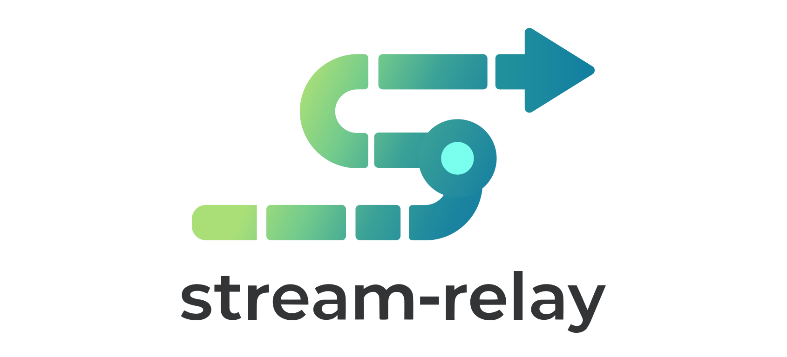

# stream-relay



Keep long-lived streaming responses alive when middleboxes enforce hard timeouts, with intelligent request compression for LLM conversations.

## Why?

Infrastructure like Cloudflare enforces a 100-second timeout on HTTP connections. For LLM APIs that stream responses over minutes, this breaks the connection mid-response.

**stream-relay solves this with:**

1. **Timeout Immunity** - Uses short-lived HTTP requests (25s max) instead of long-lived connections. No connection ever exceeds infrastructure timeouts.

2. **BodyDict Compression** - JSON-aware deduplication for LLM request bodies. After 100 conversation rounds, achieves ~99% bandwidth savings by only sending new content.

## Architecture

```
Browser/Client <--[Cloudflare]--> Relay Server <--> LLM API
     |                                  |
     |  Short polls (25s max)           |  Direct connection
     |  BodyDict compression            |  (no timeout issues)
     v                                  v
```

The relay consists of:

- A **relay server** (Go) that proxies requests to upstream APIs and buffers responses in Redis
- A **browser SDK** (`browser-sdk/pipe-client.js`) for direct browser-to-relay communication
- A **Node.js client** (`client/pipe-client.js`) for server-side usage
- A **local proxy** (`client/client.js`) that makes any HTTP client work through the relay

## Key Benefits

### Timeout Immunity

| Connection | Duration | Result |
|------------|----------|--------|
| Client → Relay | 25s max per poll | Never times out |
| Relay → LLM API | Minutes | Direct, no middlebox |

Even if an LLM takes 5 minutes to respond, the client never holds a connection longer than 25 seconds.

### BodyDict Compression

LLM conversations grow with each turn - the full history is sent every request. BodyDict extracts and deduplicates large JSON values:

| Round | Context Size | Actually Sent | Savings |
|-------|-------------|---------------|---------|
| 1 | 5 KB | 5 KB | 0% |
| 10 | 50 KB | ~5 KB | ~90% |
| 50 | 250 KB | ~5 KB | ~98% |
| 100 | 500 KB | ~5 KB | ~99% |

Only new messages are transmitted - previous conversation history is referenced by SHA256 hash.

### Compression Benchmark

Tested with 10-round LLM conversation (87.9 KB original data):

| Mode | Wire Size | Ratio | vs Baseline |
|------|-----------|-------|-------------|
| Brotli only | 29.4 KB | 33.5% | baseline |
| BodyDict + Brotli (base64) | 22.9 KB | 26.1% | 22% better |
| **BodyDict + Brotli (BSON)** | **20.0 KB** | **22.8%** | **32% better** |

BSON mode eliminates base64 overhead for maximum compression.

## Quick Start

### Requirements

- **Go 1.21+** for the relay server
- **Node.js 18+** for the client/SDK (uses `undici` for connection pooling)
- **Redis** at `redis://127.0.0.1:6379` (or configure via `REDIS_URL`)

### Run the Relay Server

```bash
cd server-go
go mod download
go run .
# Listens on :29999 by default
```

### Browser SDK Usage

```html
<script src="./browser-sdk/pipe-client.js"></script>
<script>
const client = PipeClient.createPipeClient({
  serverBase: 'https://relay.example.com',
  bodyDictEnabled: true,    // Enable compression (default: true)
  bodyDictMinSize: 1024     // Compress values >1KB (default: 1024)
});

await client.init();

const stream = await client.start({
  url: 'https://api.anthropic.com/v1/messages',
  method: 'POST',
  headers: {
    'Content-Type': 'application/json',
    'x-api-key': 'YOUR_API_KEY',
    'anthropic-version': '2023-06-01'
  },
  body: {
    model: 'claude-sonnet-4-20250514',
    max_tokens: 1024,
    messages: conversationHistory  // Large, repetitive - gets compressed!
  },
  onDelta(chunk) {
    // Process streaming response chunk (Uint8Array)
    console.log(new TextDecoder().decode(chunk));
  },
  onDone(err) {
    if (err) console.error('Error:', err);
    else console.log('Stream complete');
  }
});

await stream.ack();  // Acknowledge completion
</script>
```

### Node.js Client Usage

```javascript
const { createPipeClient } = require('./client/pipe-client.js');

const client = createPipeClient({
  serverBase: 'http://localhost:29999'
});

await client.init();

const stream = await client.start({
  url: 'https://api.openai.com/v1/chat/completions',
  method: 'POST',
  headers: {
    'Content-Type': 'application/json',
    'Authorization': 'Bearer YOUR_API_KEY'
  },
  body: {
    model: 'gpt-4',
    stream: true,
    messages: conversationHistory
  },
  onDelta(chunk) {
    process.stdout.write(chunk.toString());
  },
  onDone(err) {
    if (err) console.error('Error:', err);
  }
});

await stream.ack();
```

### Local Proxy (for any HTTP client)

Run a local proxy that makes any HTTP client work through the relay:

```bash
cd client
SERVER_BASE=http://localhost:29999 \
UPSTREAM_BASE=https://api.openai.com \
node client.js
# Proxy listens on :9999
```

Point your application to `http://127.0.0.1:9999` instead of the upstream API.

## Running Tests

### Node.js Compression Test

```bash
./example/pipe-compression-test/run.sh
```

### Browser SDK Test

```bash
./example/pipe-browser-test/run.sh
# Open http://127.0.0.1:4001/ in browser
```

## Environment Variables

### Server (Go)

| Variable | Description | Default |
|----------|-------------|---------|
| `PORT` | HTTP listen port | `29999` |
| `REDIS_URL` | Redis connection string | `redis://127.0.0.1:6379` |
| `TTL_SECONDS` | Redis key TTL | `1800` |
| `LONG_POLL_MAX_MS` | Max poll wait time | `30000` |

### Client (Node.js)

| Variable | Description | Default |
|----------|-------------|---------|
| `LISTEN_PORT` | Local proxy port | `9999` |
| `STATS_PORT` | Stats dashboard port | `9998` |
| `SERVER_BASE` | Relay server URL | **Required** |
| `UPSTREAM_BASE` | Target API URL | **Required** |
| `PIPE_BODYDICT` | Enable BodyDict compression (`0` to disable) | `1` (enabled) |
| `PIPE_DICT_MIN_SIZE` | Min size for chunk extraction | `1024` |
| `PIPE_BROTLI` | Enable Brotli compression (`0` to disable) | `1` (enabled) |
| `PIPE_BROTLI_QUALITY` | Brotli quality level (1-11) | `11` |
| `PIPE_BSON` | Enable BSON encoding (`0` to disable) | `1` (enabled) |

**All compression features enabled by default for optimal bandwidth savings (~6-7% compression ratio).**

To disable individual features:
```bash
PIPE_BODYDICT=0                    # Disable BodyDict (use raw Brotli only)
PIPE_BSON=0                        # Use base64 instead of BSON
PIPE_BROTLI=0                      # Disable Brotli
```

## How It Works

### Pipe Protocol

1. **Open Session**: Client calls `/pipe/open` to get a `sessionId`
2. **Send Request**: Client sends request frame to `/pipe/send`
3. **Poll Response**: Client polls `/pipe/recv` (blocks up to 25s waiting for data)
4. **Stream Data**: Server pushes response chunks to Redis, returned on next poll
5. **Acknowledge**: Client sends `/pipe/ack` to clean up

### BodyDict Compression

1. Client extracts JSON values larger than threshold (default 1KB)
2. Each value is hashed with SHA256 and replaced with `{"$ref": "sha256:..."}`
3. New chunks are sent in `put` map:
   - **v1 (JSON)**: hash → base64-encoded data
   - **v2 (BSON)**: hash → raw binary (no base64 overhead)
4. Server stores chunks in Redis with 3-hour TTL
5. Subsequent requests reference cached chunks - only new content is sent
6. Brotli compression is applied to the wire format (quality 11 by default)

If server is missing chunks (e.g., Redis eviction), it returns 422 with missing refs. Client automatically resends those chunks and retries.

### Stats Dashboard

The Node.js client includes a real-time stats dashboard at `http://127.0.0.1:9998` (configurable via `STATS_PORT`) showing:
- Total requests and compression ratios
- Original vs wire bytes
- Per-request compression metrics

## Production Deployment

### Docker

```bash
docker build -t stream-relay/server:latest -f server-go/Dockerfile server-go/
```

### Kubernetes

```bash
./scripts/deploy-golang-version.sh [IMAGE_TAG]
```

See `k8s/` directory for complete Kubernetes manifests including Redis StatefulSet.

## License

MIT
